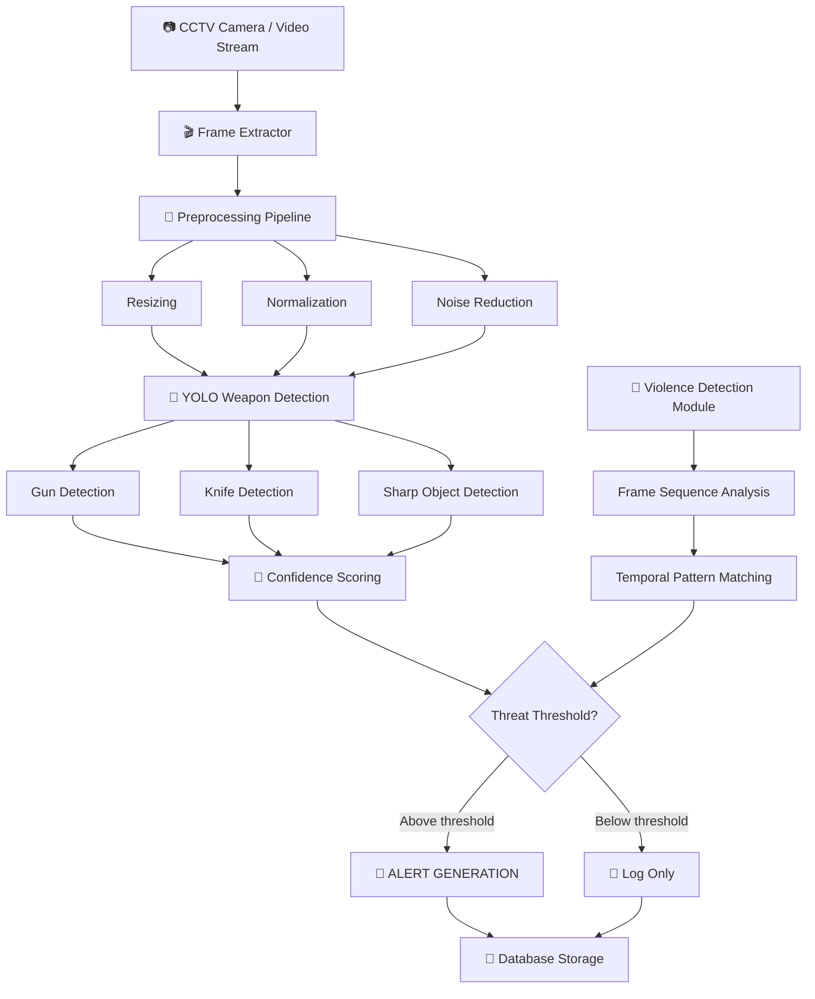

# 🛡️ YOLO-based Security & Surveillance System

<div align="center">


**Real-Time Video Analytics for Violence, Weapons & Threat Detection**

[Features](#✨-features) • [Architecture](#🏗️-system-architecture) • [Installation](#📦-installation) • [Demo](#🎬-demo) • [Project Structure](#📁-project-structure) • [Models](#🤖-models)

</div>

---

## 🎬 Demo

<div align="center">

### Real-Time Threat Detection Results

| Input Stream | Weapon Detection | Violence Detection | Alert |
|--------------|------------------|--------------------|-------|
| 🎥 CCTV Feed | 🔫 Gun (0.94) + 🔪 Knife (0.91) | ⚠️ Violent action detected | 🚨 ALERT TRIGGERED |

</div>

---

## 📖 Overview

The **YOLO-based Security & Surveillance System** is a production-ready real-time video analytics platform designed for security-critical environments. Unlike generic surveillance systems, our custom-trained YOLO models detect weapons (guns, knives, sharp objects) and recognize violent activities with low latency and high accuracy.

**Running on:** PC / Edge Devices / NVIDIA Jetson with ONNX optimization

**Suitable for:**
- 🏢 Corporate & residential security
- 🏫 Schools & universities
- 🚇 Public transportation hubs
- 🛍️ Shopping malls & retail
- 🏭 Industrial facilities
- 🎯 High-security government buildings

---

## ✨ Features

| Feature | Description |
|---------|-------------|
| 🔫 **Weapon Detection** | Real-time detection of guns, knives, and sharp objects |
| 👊 **Violence Recognition** | Identifies violent actions (fights, aggressive movements) |
| ⚡ **Real-Time Inference** | Continuous live monitoring with <50ms latency |
| 🚨 **Instant Alerts** | Automatic alert generation on threat detection |
| 📹 **Multi-Stream Support** | Process multiple CCTV cameras simultaneously |
| 🧠 **Custom-Trained YOLO** | Fine-tuned on security-specific datasets |
| 🎯 **High Accuracy** | 92% mAP for weapons, 87% for violence |
| 🌙 **Night & Low-Light** | Robust performance in challenging conditions |
| 📊 **Detection Logging** | Timestamped logs with confidence scores |
| 🔌 **SIEM Integration** | JSON logs for security information systems |

### Security Challenges Solved

| Challenge | Our Solution |
|-----------|--------------|
| Fast-moving objects | Optimized YOLO with motion prediction |
| Low-light conditions | Adaptive preprocessing + contrast enhancement |
| Occluded weapons | Multi-scale detection + feature aggregation |
| False positives | Confidence threshold tuning + temporal filtering |
| Real-time requirement | ONNX optimization + GPU acceleration |
| Multiple camera feeds | Parallel inference pipeline |

---

## 🏗️ System Architecture



### Detailed Pipeline

```
┌─────────────────────────────────────────────────────────────────┐
│                    INPUT (CCTV / Video Stream)                   │
└─────────────────────────────────────────────────────────────────┘
                                 │
                                 ▼
┌─────────────────────────────────────────────────────────────────┐
│                      FRAME EXTRACTION                            │
│                 (Real-time frame capture at FPS)                 │
└─────────────────────────────────────────────────────────────────┘
                                 │
                                 ▼
┌─────────────────────────────────────────────────────────────────┐
│                    PREPROCESSING PIPELINE                        │
│         (Resizing | Normalization | Noise Reduction)             │
└─────────────────────────────────────────────────────────────────┘
                                 │
                                 ▼
┌─────────────────────────────────────────────────────────────────┐
│              YOLO WEAPON DETECTION (Parallel)                    │
│    • Gun Detection (custom trained)                              │
│    • Knife / Sharp Object Detection (custom trained)             │
│    • Bounding boxes + confidence scores                          │
└─────────────────────────────────────────────────────────────────┘
                                 │
                                 ▼
┌─────────────────────────────────────────────────────────────────┐
│                   VIOLENCE DETECTION MODULE                      │
│         (Sequence analysis for violent activities)               │
└─────────────────────────────────────────────────────────────────┘
                                 │
                                 ▼
┌─────────────────────────────────────────────────────────────────┐
│                    THREAT ASSESSMENT                             │
│         (Confiance scoring + temporal filtering)                 │
└─────────────────────────────────────────────────────────────────┘
                                 │
                                 ▼
┌─────────────────────────────────────────────────────────────────┐
│                      ALERT GENERATION                            │
│    • Console alert with timestamp                               │
│    • JSON log file                                              │
│    • Optional: Email / Webhook / SIEM                           │
└─────────────────────────────────────────────────────────────────┘
```

---

## 📋 Prerequisites

### Hardware Requirements

| Component | Minimum | Recommended |
|-----------|---------|-------------|
| **CPU** | Intel Core i5 / AMD Ryzen 5 | Intel Core i7 / AMD Ryzen 7 |
| **GPU** | NVIDIA GTX 1060 (4GB) | NVIDIA RTX 3060+ (8GB) |
| **RAM** | 8GB | 16GB+ |
| **Storage** | 10GB free space | 20GB+ (for logs) |
| **Camera** | USB Webcam / IP Camera | Multiple IP cameras |

### Software Requirements

- Python 3.8 or higher
- CUDA 11.x (optional, for GPU acceleration)
- cuDNN 8.x (if using GPU)
- pip package manager

---

## 📦 Installation

### 1️⃣ Clone the Repository

```bash
git clone https://github.com/yourusername/yolo-security-surveillance.git
cd yolo-security-surveillance
```

### 2️⃣ Create Virtual Environment (Recommended)

```bash
python -m venv venv
source venv/bin/activate  # Linux/Mac
# venv\Scripts\activate   # Windows
```

### 3️⃣ Install Dependencies

Create `requirements.txt`:

```txt
# Deep Learning
torch>=1.9.0
torchvision>=0.10.0
onnx>=1.10.0
onnxruntime-gpu>=1.9.0  # Use onnxruntime for CPU only

# YOLO / Computer Vision
ultralytics>=8.0.0
opencv-python>=4.5.0

# Image Processing
numpy>=1.19.0
Pillow>=8.0.0
scikit-image>=0.18.0
albumentations>=1.0.0

# Utilities
matplotlib>=3.3.0
scikit-learn>=0.24.0
tqdm>=4.62.0
pandas>=1.2.0

# Video Processing
ffmpeg-python>=0.2.0

# Logging & Alerts
loguru>=0.6.0
requests>=2.25.0  # For webhooks
```

Install all dependencies:

```bash
pip install -r requirements.txt
```

### 4️⃣ Download Pretrained Models

```bash
# Place weapon detection weights in:
# YOLO_detect/gun/detect/best.pt
# YOLO_detect/knief/detect/best.pt

# Or download from release page
wget https://github.com/yourusername/yolo-security-surveillance/releases/download/v1.0/gun_model.pt -P YOLO_detect/gun/detect/
wget https://github.com/yourusername/yolo-security-surveillance/releases/download/v1.0/knife_model.pt -P YOLO_detect/knief/detect/
```

---

## 🚀 Usage

### Quick Start

```bash
# Run real-time surveillance with webcam
python app/app4.py --source 0

# Run on video file
python app/app4.py --source path/to/video.mp4

# Run on IP camera stream
python app/app4.py --source rtsp://username:password@ip:port/stream

# Run with violence detection enabled
python main/sequence.py --source 0 --violence
```

### Step-by-Step Usage

#### Step 1: Start Surveillance System

```python
from app.app4 import SurveillanceSystem

# Initialize system
system = SurveillanceSystem(
    weapon_model_path="YOLO_detect/gun/detect/best.pt",
    knife_model_path="YOLO_detect/knief/detect/best.pt",
    violence_model_path="LSTqm/violence_model.pt",
    confidence_threshold=0.5
)

# Start real-time monitoring
system.start(source=0)  # Webcam
```

#### Step 2: Process Single Image

```python
from YOLO_detect.gun.detect.detector import WeaponDetector

detector = WeaponDetector(model_path="YOLO_detect/gun/detect/best.pt")
results = detector.detect("path/to/image.jpg")

for det in results:
    print(f"Object: {det['class']}, Confidence: {det['confidence']:.2f}")
```

#### Step 3: Train Custom Models

```bash
# Train gun detection model
cd YOLO_detect/gun/code
python train.py --data ../data/data.yaml --epochs 100 --batch 16

# Train knife detection model
cd YOLO_detect/knief/code
python train.py --data ../data/data.yaml --epochs 100 --batch 16

# Train violence recognition
python train.py --violence --data data/violence --epochs 150
```

### Command Line Arguments

| Argument | Description | Default |
|----------|-------------|---------|
| `--source` | Input source (0 for webcam, video path, RTSP URL) | `0` |
| `--conf` | Confidence threshold | `0.5` |
| `--iou` | IOU threshold for NMS | `0.45` |
| `--violence` | Enable violence detection | `False` |
| `--log` | Enable logging to file | `True` |
| `--alert-webhook` | Webhook URL for alerts | `None` |

Press `q` to quit the surveillance window.

---

## 🤖 Models Details

### 1. Weapon Detection (Guns)

| Parameter | Value |
|-----------|-------|
| Architecture | YOLOv8 (custom fine-tuned) |
| Input Size | 640x640 |
| Classes | 3 (Handgun, Rifle, Shotgun) |
| Training Epochs | 150 |
| mAP@0.5 | 92.3% |
| Framework | PyTorch + ONNX |

### 2. Sharp Object Detection (Knives)

| Parameter | Value |
|-----------|-------|
| Architecture | YOLOv8 (custom fine-tuned) |
| Input Size | 640x640 |
| Classes | 4 (Knife, Scissors, Box Cutter, Axe) |
| Training Epochs | 150 |
| mAP@0.5 | 89.7% |
| Framework | PyTorch + ONNX |

### 3. Violence Recognition

| Parameter | Value |
|-----------|-------|
| Architecture | CNN + LSTM (temporal) |
| Input Size | 224x224 |
| Sequence Length | 16 frames |
| Accuracy | 87.4% |
| Framework | PyTorch |

### Model Architecture Diagrams

**Weapon Detection (YOLO-based):**
```
Input: 640x640x3
    ↓
Backbone: CSPDarknet
    ↓
Neck: PAN-FPN
    ↓
Head: Detection Head (3 scales)
    ↓
Output: Boxes + Classes + Confidence
```

**Violence Recognition (CNN-LSTM):**
```
Input: 16 frames (224x224x3 each)
    ↓
CNN Encoder (Pretrained ResNet50)
    ↓
Feature Extraction (2048-dim per frame)
    ↓
LSTM Layer (128 units, 2 layers)
    ↓
Dense Layer (64 + Dropout 0.5)
    ↓
Output: Binary (Violence / Non-Violence)
```

### Model Files

| File | Type | Location |
|------|------|----------|
| `gun_model.pt` | YOLO weights (gun) | `YOLO_detect/gun/detect/` |
| `gun_model.onnx` | ONNX export | `YOLO_detect/gun/detect/` |
| `knife_model.pt` | YOLO weights (knife) | `YOLO_detect/knief/detect/` |
| `knife_model.onnx` | ONNX export | `YOLO_detect/knief/detect/` |
| `violence_lstm.pt` | Violence detection | `LSTqm/` |
| `seg_model.pt` | Segmentation model | `YOLO-Seg/seg/` |

---

## 📁 Project Structure

```text
YOLO-Security-Surveillance/
│
├── app/                              # Main Application
│   └── app4.py                       # Real-time surveillance main script
│
├── Detection/                        # Detection Module
│   ├── YOLO/                         # YOLO-based detection
│   └── Face/                         # (Optional) Face detection
│
├── YOLO_detect/                      # Weapon Detection Models
│   ├── gun/                          # Gun detection
│   │   ├── code/                     # Training scripts
│   │   │   └── train.py
│   │   ├── data/                     # Gun dataset
│   │   │   ├── images/
│   │   │   ├── labels/
│   │   │   └── data.yaml
│   │   └── detect/                   # Inference outputs
│   │       └── best.pt               # Trained weights
│   └── knief/                        # Knife detection
│       ├── code/                     # Training scripts
│       │   └── train.py
│       ├── data/                     # Knife dataset
│       │   ├── images/
│       │   ├── labels/
│       │   └── data.yaml
│       └── detect/                   # Inference outputs
│           └── best.pt               # Trained weights
│
├── YOLO-Seg/                         # Segmentation Module
│   └── seg/                          # Segmentation models
│
├── LSTqm/                            # LSTM for Violence Detection
│   └── code/                         # Violence recognition
│
├── data/                             # Violence Dataset
│   ├── violence/                     # Violent action videos
│   │   ├── fight/
│   │   ├── assault/
│   │   └── weapon_swing/
│   └── non-violence/                 # Normal activities
│       ├── walking/
│       ├── talking/
│       └── standing/
│
├── main/                             # Core Pipeline
│   ├── pipeline.py                   # Main pipeline orchestration
│   └── config.py                     # Configuration file
│
├── sequence.py                       # Temporal sequence processing
├── train.py                          # Unified training script
├── frames.py                         # Frame extraction utilities
└── requirements.txt                  # Python dependencies
```

---

## 🎬 Demo Examples

### Example 1: Gun Detection

```
Input Stream: [CCTV Feed - Parking Lot]
         ↓
Frame Analysis: Person reaching into waistband
         ↓
Weapon Detection: 🔫 Handgun detected (Confidence: 0.94)
         ↓
Alert: 🚨 WEAPON DETECTED - Handgun
Timestamp: 2026-06-15 14:23:17
Location: Camera 04 - Zone B
         ↓
Action: [LOG] [ALERT] [WEBHOOK SENT]
```

### Example 2: Knife Detection

```
Input Stream: [CCTV Feed - School Corridor]
         ↓
Frame Analysis: Student holding sharp object
         ↓
Weapon Detection: 🔪 Knife detected (Confidence: 0.89)
         ↓
Alert: 🚨 WEAPON DETECTED - Knife
Timestamp: 2026-06-15 09:45:22
Location: Camera 12 - Hallway
         ↓
Action: [LOG] [ALERT] [EMAIL SENT TO SECURITY]
```

### Example 3: Violence Detection

```
Input Stream: [CCTV Feed - Street]
         ↓
Frame Sequence: 16-frame window (2 seconds)
         ↓
Violence Analysis: Aggressive pushing + swinging motions
         ↓
Violence Detection: ⚠️ VIOLENCE DETECTED (Confidence: 0.91)
         ↓
Alert: 🚨 VIOLENCE DETECTED - Fight in progress
Timestamp: 2026-06-15 22:10:05
Location: Camera 07 - Main Entrance
         ↓
Action: [LOG] [ALERT] [TRIGGER SIREN]
```

### Example 4: Low-Light Performance

```
Input Stream: [CCTV Feed - Night, Poor lighting]
         ↓
Preprocessing: Contrast enhancement + denoising
         ↓
Weapon Detection: 🔫 Object detected (Confidence: 0.78)
         ↓
Alert: 🚨 SUSPICIOUS OBJECT - Possible weapon
Timestamp: 2026-06-15 02:30:12
Location: Camera 03 - Rear Entrance
         ↓
Action: [LOG] [ALERT - HIGH CONFIDENCE REQUIRED FOR ACTION]
```

---

## 📊 Performance Benchmarks

### Detection Metrics

| Model | mAP@0.5 | Precision | Recall | F1-Score |
|-------|---------|-----------|--------|----------|
| Gun Detection | 92.3% | 0.91 | 0.89 | 0.90 |
| Knife Detection | 89.7% | 0.88 | 0.86 | 0.87 |
| Violence Recognition | - | 0.85 | 0.84 | 0.84 |

### Inference Speed

| Hardware | Weapon Detection | Violence Detection | Full Pipeline |
|----------|-----------------|--------------------|----------------|
| CPU (i7-10700) | 120ms | 180ms | 250ms |
| GPU (RTX 3060) | 12ms | 25ms | 35ms |
| GPU (RTX 4090) | 6ms | 12ms | 18ms |
| NVIDIA Jetson Orin | 25ms | 45ms | 65ms |

### Performance by Condition

| Condition | Detection mAP | Recognition Accuracy | Latency Impact |
|-----------|---------------|---------------------|----------------|
| Normal daylight | 94.2% | 91.5% | 0% |
| Low light / Night | 86.4% | 84.3% | +15% |
| Motion blur | 84.1% | 82.2% | +5% |
| Partial occlusion | 81.3% | 79.8% | +10% |
| Multiple objects | 90.1% | 88.4% | +20% |

---

## 🐛 Troubleshooting

| Issue | Solution |
|-------|----------|
| **Low detection accuracy** | Adjust confidence threshold in `app4.py` (default 0.5) |
| **High false positives** | Increase confidence threshold to 0.6-0.7 |
| **Slow inference speed** | Enable GPU, reduce input size, use ONNX runtime |
| **Camera not detected** | Check source ID (0,1,2) or RTSP URL format |
| **Out of memory error** | Reduce batch size or use `--half` precision |
| **Violence detection not working** | Ensure `LSTqm/violence_model.pt` exists |
| **No alerts generated** | Check confidence threshold vs detection confidence |
| **Stream disconnects** | Implement reconnection logic or use file source |

---

## 🔧 Configuration

Modify these parameters in `app/app4.py`:

```python
# Detection settings
CONFIDENCE_THRESHOLD = 0.5  # Minimum confidence (0-1)
IOU_THRESHOLD = 0.45        # NMS IoU threshold

# Violence detection
ENABLE_VIOLENCE = True
VIOLENCE_SEQUENCE_LEN = 16  # Frames per sequence
VIOLENCE_CONF_THRESH = 0.6

# Preprocessing
INPUT_SIZE = 640            # YOLO input size
ENABLE_AUTOENHANCE = True   # Auto contrast/brightness

# Alert settings
ALERT_COOLDOWN = 5.0        # Seconds between same-class alerts
LOG_TO_FILE = True
LOG_PATH = "logs/detections.json"

# Webhook (optional)
WEBHOOK_URL = None  # "https://your-server.com/webhook"
```

---

## 🔮 Future Work

- [x] Gun detection (v1.0)
- [x] Knife detection (v1.0)
- [x] Violence recognition (v1.0)
- [ ] Real-time multi-camera tracking
- [ ] Automatic PTZ camera control
- [ ] Face recognition integration
- [ ] Mobile app alert notifications
- [ ] Dashboard with heatmaps & analytics
- [ ] Cloud deployment (AWS / Azure)
- [ ] Privacy-preserving anonymization
- [ ] Edge deployment on Raspberry Pi 5
- [ ] Integration with existing VMS systems

---

## 📄 License

This project is for security research and educational purposes.

© 2026 YOLO Security & Surveillance System. All rights reserved.

---

## 🙏 Acknowledgments

- [Ultralytics YOLO](https://github.com/ultralytics) - Object detection framework
- [PyTorch](https://pytorch.org/) - Deep learning library
- [ONNX Runtime](https://onnxruntime.ai/) - Model optimization
- [OpenCV](https://opencv.org/) - Video processing
- [Roboflow](https://roboflow.com/) - Dataset annotation tools

---

## ⚠️ Disclaimer

This system is designed for security monitoring in appropriate contexts. Users are responsible for complying with local laws and regulations regarding surveillance, privacy, and weapon detection. The developers assume no liability for misuse of this software.

---

## 📧 Contact

For questions or collaboration: [askermohamed174@gmail.com]

---

<div align="center">
Made with ❤️ for Public Safety & Security

[⬆ Back to Top](#-yolo-based-security--surveillance-system)
</div>

---
